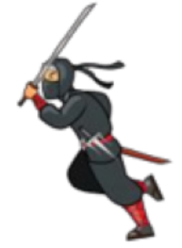
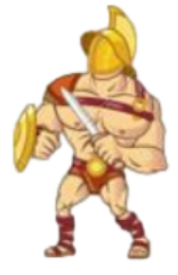

# Swords-of-Honor-Ninja-vs-Romans
### A video game written in Allegro5 and C language

[**Swords-of-Honor-Ninja-vs-Romans**](https://github.com/jerryboy1031/Swords-of-Honor-Ninja-vs-Romans/edit/main) is a video game. It features a beautiful game scene,  delicated actions, and two characters: a Ninja and Romans soldier, fighting until one of them is dead. 
What's more, the tints (i.e. hurt tint) and actions are beyond description.

It is **authored by** [**Ginés Hidalgo**](https://www.gineshidalgo.com), [**Zhe Cao**](https://people.eecs.berkeley.edu/~zhecao), [**Tomas Simon**](http://www.cs.cmu.edu/~tsimon), [**Shih-En Wei**](https://scholar.google.com/citations?user=sFQD3k4AAAAJ&hl=en), [**Yaadhav Raaj**](https://www.raaj.tech), [**Hanbyul Joo**](https://jhugestar.github.io), **and** [**Yaser Sheikh**](http://www.cs.cmu.edu/~yaser). It is **maintained by** [**Ginés Hidalgo**](https://www.gineshidalgo.com) **and** [**Yaadhav Raaj**](https://www.raaj.tech). OpenPose would not be possible without the [**CMU Panoptic Studio dataset**](http://domedb.perception.cs.cmu.edu). We would also like to thank all the people who [have helped OpenPose in any way](doc/09_authors_and_contributors.md).

    
     
    Authors <a href="https://www.gineshidalgo.com" target="_blank">Ginés Hidalgo</a> (left) and <a href="https://jhugestar.github.io" target="_blank">Hanbyul Joo</a> (right) in front of the <a href="http://domedb.perception.cs.cmu.edu" target="_blank">CMU Panoptic Studio</a>

## Contents
1. [Results](#results)
2. [Features](#features)
3. [Contributors](#contributors)
4. [Installation](#installation)
6. [Send Us Feedback!](#send-us-feedback)
7. [Citation](#citation)
8. [License](#license)

## Results
### Gameplay

    
     
    Testing OpenPose: (Left) <a href="https://www.youtube.com/watch?v=2DiQUX11YaY" target="_blank"><i>Crazy Uptown Funk flashmob in Sydney</i></a> video sequence. (Center and right) Authors <a href="https://www.gineshidalgo.com" target="_blank">Ginés Hidalgo</a> and <a href="http://www.cs.cmu.edu/~tsimon" target="_blank">Tomas Simon</a> testing face and hands

## Features
**Main Functionality**:
- **2D real-time multi-person keypoint detection**:
    - 15, 18 or **25-keypoint body/foot keypoint estimation**, including **6 foot keypoints**. **Runtime invariant to number of detected people**.
    - **2x21-keypoint hand keypoint estimation**. **Runtime depends on number of detected people**. See [**OpenPose Training**](https://github.com/CMU-Perceptual-Computing-Lab/openpose_train) for a runtime invariant alternative.
    - **70-keypoint face keypoint estimation**. **Runtime depends on number of detected people**. See [**OpenPose Training**](https://github.com/CMU-Perceptual-Computing-

- **Fondamental units**:
    -  start
    -  exit
    -  icon
- **Fondamental game scenes**:
    -  menu
    -  gameplay
    -  gameover
- **Main units**
  - characters
    - ninja
    - Romans soldier

    
    
     

- **Qualification**
  - health bar (HP)

- **Qualification**
  - health bar (HP)

- **Gameplay**
  - Interaction (fighting)
  - Character sound effects (swinging swords, jumping)
  - MENU sound effects
  - Game start sound effect
  - Game ending sound effect
  - Special effects of being injured (character turns red)
  - Boundary setting

- **Moving of Character**
  -  moves horizontally
  -  horizontal acceleration
  -  vertical jump
  -  attack with a sword
    
### Concept figures
- Menu
- GamePlay
- GameOver

## Contributors
- [**陳佳俊**](https://github.com/jerryboy1031)
- **練韋辰**
- **高茝媛**
  
My two teammates and I came up with the game set together, for example, what's a fighting game be like, what are essential functions or elements in the game. Then, we had spending total a week collaborating to make this happened.

There's no part that I am completely responsible, but I had helped other teammate debug, fixed fundamental problems, and finished almost 95% of "character.c" file. "character.c" file may be the most important and difficult file in this game, and the lines of code is the biggest, too.

## Installation
If you want to use OpenPose without installing or writing any code, simply [download and use the latest Windows portable version of OpenPose](doc/installation/0_index.md#windows-portable-demo)!

Otherwise, you could [build OpenPose from source](doc/installation/0_index.md#compiling-and-running-openpose-from-source). See the [installation doc](doc/installation/0_index.md) for all the alternatives.

## Send Us Feedback!
If you have any question, please let us know (create a new GitHub issue or pull request, email us, etc.) if you...
1. Find/fix any bug (in functionality or speed) or know how to speed up or improve any part of OpenPose.
2. Want to add/show some cool functionality/demo/project made on top of it. 

## License
OpenPose is freely available for free non-commercial use, and may be redistributed under these conditions. Please, see the [license](./LICENSE) for further details.
