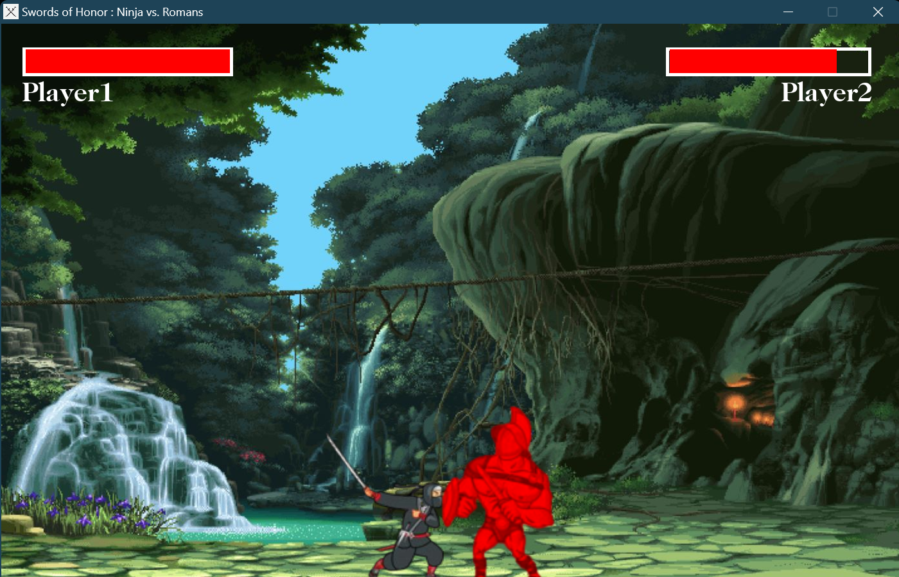

# Swords-of-Honor-Ninja-vs-Romans
### A video game written in Allegro5 and C language

    
     
    Game cover designed by [**陳佳俊**](https://github.com/jerryboy1031)
    

[**Swords-of-Honor-Ninja-vs-Romans**](https://github.com/jerryboy1031/Swords-of-Honor-Ninja-vs-Romans/edit/main) is a video game. It features a beautiful game scene,  delicated actions, and two characters: a Ninja and Romans soldier, fighting until one of them is dead. 
What's more, the tints (i.e. hurt tint) and actions are beyond description.

It is **authored by** [**陳佳俊**](https://github.com/jerryboy1031), **練韋辰**, and **高茝媛**. It is **maintained by** [**陳佳俊**](https://github.com/jerryboy1031). This project would not be possible without all these members. We would also like to thank all the people who have helped us in any way.

    
     
    Authors 陳佳俊(left), 練韋辰(mid), and 高茝媛(right)
    

## Contents
1. [Results](#results)
2. [Features](#features)
3. [Contributors](#contributors)
4. [Installation](#installation)
5. [Send Us Feedback!](#send-us-feedback)
6. [License](#license)

## Results
### Gameplay

    
    
    
     
    Start fighting scene(Left), Attack action(Center), hurting tints(Right) 

## Features
- **Fondamental units**:
    -  start
    -  exit
    -  icon
- **Fondamental game scenes**:
    -  menu
    -  gameplay
    -  gameover
- **Main units**
  - characters
    - ninja
    - Romans soldier

    
    
     

- **Qualification**
  - health bar (HP)

- **Gameplay**
  - Interaction (fighting)
  - Character sound effects (swinging swords, jumping)
  - MENU sound effects
  - Game start sound effect
  - Game ending sound effect
  - Special effects of being injured (character turns red)
  - Boundary setting

- **Moving of Character**
  -  moves horizontally
  -  horizontal acceleration
  -  vertical jump
  -  attack with a sword
    
### Concept figures
- Menu

    
     

- GamePlay

    
     

- GameOver

    
     

## Contributors
- [**陳佳俊**](https://github.com/jerryboy1031)
- **練韋辰**
- **高茝媛**
  
My two teammates and I came up with the game set together, for example, what's a fighting game be like, what are essential functions or elements in the game. Then, we had spending total a week collaborating to make this happened.

There's no part that I am completely responsible, but I had helped other teammate debug, fixed fundamental problems, and finished almost 95% of "character.c" file. "character.c" file may be the most important and difficult file in this game, and the lines of code is the biggest, too.

## Send Us Feedback!
Our library is open source for research purposes, and we want to improve it! So let us know (create a new GitHub issue or pull request, email us, etc.) if you...
1. Find/fix any bug (in functionality or speed) or know how to speed up or improve any part of OpenPose.
2. Want to add/show some cool functionality/demo/project made on top of it. We can add your project link to our project.

## License
OpenPose is freely available for free non-commercial use, and may be redistributed under these conditions. Please, see the [license](./LICENSE) for further details.
